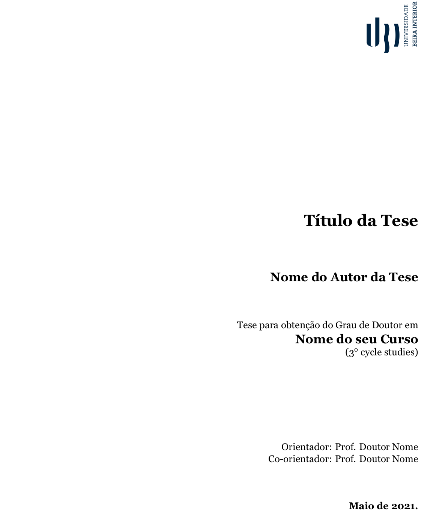

:pdf_link: https://github.com/manoelcampos/template-ubi-latex/blob/gh-pages/Thesis.pdf

:numbered:
:icons: font
:toc-title: Sumário
ifndef::env-github[:toc: left]
ifdef::env-github[:outfilesuffix: .adoc]

ifdef::env-github,env-browser[]
// Exibe ícones para os blocos como NOTE e IMPORTANT no GitHub
:caution-caption: :fire:
:important-caption: :exclamation:
:note-caption: :paperclip:
:tip-caption: :bulb:
:warning-caption: :warning:
endif::[]

:description: Modelo em LaTeX para a escrita de teses e dissertações da Universidade da Beira Interior (UBI)

= {description} image:https://github.com/manoelcampos/template-ubi-latex/actions/workflows/latexmk.yml/badge.svg[link=https://github.com/manoelcampos/template-ubi-latex/actions/workflows/latexmk.yml] image:https://img.shields.io/badge/license-GPL%20v3-orange.svg[license,link=http://www.gnu.org/licenses/gpl-3.0.en.html]

pass:[
]

pass:[
]

== Introdução
O presente projeto é uma versão *NÃO OFICIAL* do modelo em LaTeX de teses e dissertações da http://www.ubi.pt[Universidade da Beira Interior (UBI)] em Portugal, de acordo com o despacho reitoral nº 2019/R/630.

Esta é uma versão reestruturada do projeto original disponibilizado em http://www.e-projects.ubi.pt/latex/template.html[e-projects.ubi.pt]
que conta com os seguintes recursos e características:

* *Separação total dos comandos e formatação do template de dentro dos ficheiros tex que compõem a tese/dissertação:*
 os documentos da tese ficam extremamente simples, organizados e
 muito mais fáceis para utilizadores, mesmo iniciantes em LaTeX, perceberam seu conteúdo.
 Tal separação permite que os utilizadores possam atualizar suas teses para novas
 versões do template imediatamente e sem traumas. Isto também elimina riscos de introduzirem
 erros que façam com que a tese deixe de compilar ou mesmo que
 percam conteúdo movendo conteúdo para uma nova versão do template.
* *Inclusão de metadados no ficheiro PDF gerado (autor, assunto, etc)*:
 permite identificar, catalogar e localizar a tese mais facilmente a partir dos metadados.
* *Definição de títulos em inglês e português para todos os elementos da tese/dissertação
 (como agradecimentos, dedicatória, lista de acrônimos, lista de algoritmos, etc)*:
 Na versão anterior, apenas elementos padrões do latex (como capítulos, secções e listas de figuras)
 eram traduzidos de acordo com o idioma escolhido pelo utilizador.
* *Instruções completas com todos os pré-requisitos para compilar o template em sistemas Linux, Windows e macOS:* mostra tudo que um usuário iniciante precisa
 saber para configurar seu sistema operativo e assim compilar o template.
* *Criação dos seguintes comandos para definir informações da tese/dissertação dentro do documento do utilizador:*
** \thesisauthors : nome do autor
** \thesistitle : título da tese
** \thesissubtitle : sub-título da tese (opcional)
** \thesistype : tipo da tese (proposta de tese, dissertação de mestrado ou tese de doutoramento)
** \thesislocalanddate : sítio e data de publicação da tese
** \thesissupervisors : orientador e co-orientadores
** \thesisthanks : agradecimentos (opcional)
** \thesisdedication : dedicatória (opcional)
** \thesisforewords : prefácio (opcional)
** \thesisabstract : abstract (inglês)
** \thesisresumo : resumo (português)
** \thesisresumoalargado: resumo alargado em português (apenas para teses escritas em inglês)
** \thesisacronyms : lista de acrônimos (opcional)
** \thesisglossary : glossário (opcional)
** \facultyname : nome da faculdade
** \studiescyclenumber : número do ciclo de estudos (1º, 2º ou 3º).
** \thesisbibliography : estilo bibliográfico e arquivo de bibliografia.

Com os novos comandos, a formatação padrão do template não é misturada com o texto do documento
do utilizador, reduzindo a probabilidade deste alterar o template indevidamente (mesmo que sem querer).

== Tese de Exemplo

Juntamente com o modelo é disponibilizado um exemplo de tese, a partir do qual
o utilizador pode editar e escrever sua própria tese.
Uma versão compilada para PDF está disponível para visualização link:{pdf_link}[aqui].

E o mais legal é que ao fazer um push, seu documento é compilado e o PDF atualizado automaticamente. Desta forma, basta passar o link acima para o(a) orientador(a) que ele(a) sempre terá a versão mais atual da tese. E se você quiser saber de qual versão do documento foi gerado o PDF, basta olhar o último commit no branch `gh-pages`.

Os ficheiros desta tese de exemplo são listados a seguir.

* *Thesis.tex*: ficheiro principal do documento, a partir do qual compila-se o PDF da tese;
* *Introduction.tex* e _exemplos.tex_: exemplos de capítulos com tabelas, figuras e referências bibliográficas;
* *Acronyms.tex*: ficheiro onde deves incluir os acrônimos que estejas a utilizar na tese, para que apareçam na lista de acrônimos;
* *Appendix.tex*: um exemplo de conteúdo para ir como anexos da tese;
* *Glossary.tex*: lista de termos que desejas descrever o significado, e assim compor o glossário da tese;
* *bibliography.bib*: ficheiro em formato http://www.bibtex.org[BibTeX]
onde se inserem as referências bibliográficas a serem utilizadas na tese.
O estilo bibliográfico utilizado é definido pelo modelo, mas pode ser alterado facilmente.
Para isto, consulte a secção "Ficheiros do modelo" abaixo;
* *images*: directório onde por defeito deverão ser colocadas as imagens a utilizar.

IMPORTANT: Ao usar o template, você precisa apenas alterar o link do PDF para apontar pro seu repositório,
editando este arquivo e alterando o atributo `:pdf_link` no topo dele.

== Como utilizar o modelo pelo Overleaf para escrever sua tese

O https://www.overleaf.com[overleaf.com] é a forma mais prática para escrever documentos LaTeX, sem precisar instalar nada no seu computador. Para usar o template lá, basta aceder a https://www.overleaf.com/latex/templates/template-ubi-unofficial/dtvmtrmzyfjv[este link].

== Como utilizar o modelo no seu computador para escrever sua tese

Para utilizar o modelo são necessários alguns softwares instalados em seu sistema operativo.
O modelo pode ser utilizado para compilar teses em diferentes sistemas operativos como Windows, Linux e macOS.
A seguir são apresentados mais detalhes.

=== Editor de documentos LaTeX

Para criar e editar ficheiros tex, apesar de não ser um pré-requisito, o mais recomendável é utilizar um editor LaTeX específico.
No entanto, pode-se editar os ficheiros tex em qualquer editor de texto que suporte codificação de caracteres em UTF-8
(como o Notepad do Windows ou qualquer editor de texto nativo de sistemas Linux e macOS).

Existem diversas alternativas de editores, tanto gratuitos como pagos.
Um excelente editor que funciona em diversos sistemas operativos
é o http://www.texstudio.org[TeXstudio], que foi baseado em versões atualmente descontinuadas
do Texmaker e TexMakerX.

=== Pré-requisitos para compilar sua tese

Para compilar sua tese utilizando este modelo é preciso ter uma uma distribuição LaTeX instalada.
Existem distribuições disponíveis para os sistemas operativos mais conhecidos como Windows, Linux e macOS,
como será visto a seguir.

O compilador a ser utilizado, disponível após a instalação da distribuição LaTeX, é o _XeLaTeX_.
O _XeLaTeX_ é requerido (no lugar de outros compiladores como _PDFLaTeX_) devido a versão atual do modelo utilizar o tipo de letra _Georgia_.
Ademais, para utilizar o _XeLaTeX_ a codificação dos ficheiros tex tem que ser em UTF-8. 

As sub-secções a seguir apresentam detalhes de instalação dos pré-requisitos para cada um dos sistemas operativos em que o modelo foi testado.

==== Utilizadores de Windows

Em sistemas Windows deve ser instalada a distribuição LaTeX denominada http://miktex.org[MiKTeX].

==== Utilizadores de Linux

Em sistemas Linux deve ser instalada a distribuição LaTeX denominada _texlive-full_.
A instalação pode ser feita por meio de ferramentas gráficas como a "Central de Software" disponível em sistemas como Ubuntu, ou por meio do terminal utilizando um gerenciador de pacotes.

Diferentes distribuições Linux possuem seus próprios gerenciadores de pacote e cada utilizador deve verificar qual
é o disponível para seu sistema. No entanto, a seguir são mostrados alguns exemplos
de gerenciadores de pacotes, a serem executados a partir de um terminal, para distribuições Linux conhecidas.

* Debian e derivados (como Ubuntu e Linux Mint): `sudo apt-get install texlive-full`
* Red Hat e derivados (como Fedora e CentOS): `sudo yum install texlive-full`
* ArchLinux e derivados (como ArchBang): `sudo pacman install texlive-full`

Os utilizadores de sistema Linux baseados em Debian (como Ubuntu e Linux Mint)
têm que instalar também o pacote "ttf-mscorefonts-installer" para utilizar o tipo de letra _Georgia_.
Não foram realizados testes em outras distribuições Linux.

==== Utilizadores de macOS

Em sistemas macOS deve ser instalada a distribuição LaTeX denominada https://tug.org/mactex/[MacTeX].
Adicionalmente deve ser instalada a letra _Georgia_, cujas instruções estão disponíveis em
http://www.e-projects.ubi.pt/latex/trebuchet-macos.html.

Adicionalmente, é necessário o pacote `ghostscript` para poder utilizar imagens `.eps`.
Se você tiver o gerenciador de pacotes https://brew.sh[Homebrew], pode instalar com o comando abaixo:

[source,bash]
----
brew install ghostscript
ln -sf $(brew --prefix ghostscript)/bin/gs /usr/local/bin/gs
----

=== Como compilar a tese para PDF

Para compilar a tese de exemplo para um ficheiro PDF, pode-se definir nas configurações do seu editor LaTeX
que o compilador por defeito deve ser o _XeLaTeX_. Desta forma, sempre que mandares
compilar a tese, não precisarás escolher o compilador.
Outra forma é utilizar os menus disponíveis no editor para
escolher o _XeLaTeX_ a cada vez que for compilar a tese.

O sítio onde define-se o compilador por defeito e onde pode-se
escolher um compilador varia de acordo com o editor em uso.
Assim, verifique a documentação do seu editor para mais detalhes.

Para os programadores que são familiarizados com o terminal,
há um ficheiro link:Makefile[Makefile] que permite a compilação da tese
por meio da linha de comando. Desta forma, tendo o programa _make_ instalado
(que já vem instalado por defeito em sistemas Linux e macOS),
há os comandos abaixo disponíveis:

* *make* compila a tese de exemplo (ficheiro Thesis.tex) e se a compilação ocorrer com sucesso, cria o ficheiro Thesis.pdf;
* *make clean* apaga todos os ficheiros temporários criados no processo de compilação.

Se tiveres começado a criar sua tese utilizando um ficheiro diferente do _Thesis.tex_,
para compilar utilizando o comando _make_, é preciso editar o ficheiro link:Makefile[Makefile]
e informar o nome do ficheiro tex principal da sua tese na primeira linha do _Makefile_.

== Ficheiros específicos do modelo

Os ficheiros específicos do modelo podem ser acedidos a partir do directório link:template-ubi[template-ubi].
No entanto, ao menos que tenhas certeza do que estás a fazer, não edite tais ficheiros.
A seguir é listado o conteúdo de tal directório.

* *Styling.cls*: ficheiro principal que define o estilo de modelo de tese da UBI;
* *Formatting.sty*: define detalhes da formatação do modelo;
* *BiblioStyle.bst*: define o estilo da bibliografia, que pode ser trocado por qualquer
 outro ficheiro de acordo com a norma a utilizar (deixada em aberto pelo despacho).
 Se incluíres um novo ficheiro de estilo bibliográfico, o nome deste ficheiro
 deve ser informado no comando _\thesisbibliography_ dentro do ficheiro _Thesis.tex_.
 Os ficheiros .bst adicionais são alguns modelos de estilos bibliográficos disponibilizados
 por algumas editoras de artigos científicos. Outros modelos de estilo bibliográfico podem ser encontrados no seguinte site : https://ctan.org/topic/bibtex-sty?lang=en[CTAN].

== Licença

* O projeto é protegido pela link:LICENSE[Licença GPLv3].

== Autores

- João Ferro, Norberto Barroca, Luís Borges, Rui Paulo, Aleksandra Nadziejko - Instituto de Telecomunicações, Departamento de Engenharia Eletromecânica (DEM/UBI)
- Paulo Machado - Departamento de Ciências Aeroespaciais (DCA/UBI)
- Manoel Campos da Silva Filho - Departamento de Informática (DI/UBI)

== AVISO

Esta é uma versão modificada do http://www.e-projects.ubi.pt/latex/template.html[template oficial].
Desta forma, os autores originais não devem ser contactados a respeito de dúvidas referentes
à esta versão. Tais questões devem ser direcionadas para http://about.me/manoelcampos[Manoel Campos].
