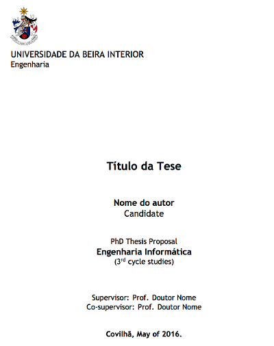

# Modelo em LaTeX para a escrita de teses na Universidade da Beira Interior (UBI) 

O presente projeto disponibiliza um modelo em LaTeX para a escrita de teses da [Universidade da Beira Interior (UBI)](http://www.ubi.pt) 
de acordo com o despacho reitoral nº [49/R/2010](https://academicos.ubi.pt/online/pdfHandler.ashx?file=bv/legislacao/Despacho_49_R_2010.pdf).

# Como utilizar o modelo para escrever sua tese

Para utilizar o modelo são necessários alguns softwares instalados em seu sistema operativo.
O modelo pode ser utilizado para compilar teses em diferentes sistemas operativos como Windows, Linux e Mac OSX.
A seguir são apresentados mais detalhes.

## Editor de documentos LaTeX

Para criar e editar ficheiros tex, apesar de não ser um pré-requisito, o mais recomendável é utilizar um editor LaTeX específico.
No entanto, pode-se editar os ficheiros tex em qualquer editor de texto que suporte codificação de caracteres em UTF-8
(como o Notepad do Windows ou qualquer editor de texto nativo de sistemas Linux e Mac OSX).

Existem diversas alternativas de editores tanto gratuitos como pagos.
Um excelente editor que funciona em diversos sistemas operativos
é o [TeXstudio](http://www.texstudio.org), que foi baseado em versões atualmente descontinuadas
do Texmaker e TexMakerX. 

## Pré-requisitos para compilar sua tese

Para compilar sua tese utilizando este modelo é preciso ter uma uma distribuição LaTeX instalada. 
Existem distribuições disponíveis para os sistemas operativos mais conhecidos como Windows, Linux e Mac OSX,
como será visto a seguir.

O compilador a ser utilizado, disponível após a instalação da distribuição LaTeX, é o *XeLaTeX*.
O *XeLaTeX* é requerido (no lugar de outros compiladores como *PDFLaTeX*) devido a versão atual do modelo utilizar o tipo de letra *Trebuchet*.
Ademais, para utilizar o *XeLaTeX* a codificação dos ficheiros tex tem que ser em UTF-8. 

As sub-secções a seguir apresentam detalhes de instalação dos pré-requisitos para cada um dos sistemas operativos em que o modelo foi testado.

### Utilizadores de Windows

Em sistemas Windows deve ser instalada a distribuição LaTeX denominada [MiKTeX](http://miktex.org).

### Utilizadores de Linux

Em sistemas Linux deve ser instalada a distribuição LaTeX denominada *texlive-full*.
A instalação pode ser feita por meio de ferramentas gráficas como a Central de Software disponível em sistemas
como Ubuntu, ou por meio do terminal utilizando um gerenciador de pacotes.

Diferentes distribuições Linux possuem seus próprios gerenciadores de pacote e cada utilizador deve verificar qual
é o utilizado em seu sistema. No entanto, a seguir são mostrados alguns exemplos
de gerenciadores de pacotes, a serem executados a partir de um terminal, para distribuições Linux conhecidas.

- Distribuições Linux baseadas em Debian (como Ubuntu e Linux Mint): `sudo apt-get install texlive-full`
- Distribuições Linux baseadas em Red Hat (como Fedora e CentOS): `sudo yum install texlive-full`
- Distribuições Linux baseadas em ArchLinux (como ArchBang): `sudo pacman install texlive-full`

Os utilizadores de sistema Linux baseados em Debian (como Ubuntu e Linux Mint) 
têm que instalar também o pacote "ttf-mscorefonts-installer" para utilizar o tipo de letra *Trebuchet*. 
Não foram realizados testes em outras distribuições Linux.

### Utilizadores de Mac OSX

Em sistemas Mac OSX deve ser instalada a disgtribuição LaTeX denominada [MacTeX](https://tug.org/mactex/).
Adicionalmente deve ser instalada a letra *Trebuchet*, cujas instruções estão disponíveis em 
<http://www.e-projects.ubi.pt/latex/trebuchet-macos.html>.

## Tese de exemplo

Juntamente com o modelo é disponibilizado um exemplo de tese, a partir do qual
o utilizador pode editar e escrever sua própria tese. 
Uma versão compilada para PDF está disponível para visualização no ficheiro [tese.pdf](tese.pdf).

Os ficheiros desta tese de exemplo são listados a seguir.

- **tese.tex**: ficheiro principal do documento, a partir do qual compila-se o PDF da tese;
- **introducao.tex** e *exemplos.tex*: exemplos de capítulos com tabelas, figuras e referências bibliográficas;
- **bibliografia.bib**: ficheiro em formato [BibTeX](http://www.bibtex.org) 
  onde se inserem as referências bibliográficas a serem utilizadas na tese. 
  O estilo bibliográfico utilizado é definido pelo modelo, mas pode ser alterado facilmente. 
  Para isto, consulte a secção "Ficheiros do modelo" abaixo;
- **imagens**: directório onde por defeito deverão ser colocadas as imagens a utilizar.

## Como compilar a tese para PDF

Para compilar a tese de exemplo para um ficheiro PDF, pode-se definir nas configurações do seu editor LaTeX 
que o compilador por defeito deve ser o *XeLaTeX*. Desta forma, sempre que mandares
compilar a tese, não precisarás escolher qual o compilador.
Outra forma é utilizar os menus disponíveis no editor para 
escolher o XeLaTeX a cada vez que for compilar a tese.

O sítio onde define-se o compilador por defeito e onde pode-se
escolher o compilador varia de acordo com o editor em uso.
Assim, verifique a documentação do seu editor para mais detalhes.

Para os programadores que são familiarizados com o terminal,
há um ficheiro [Makefile](Makefile) que permite a compilação da tese
por meio da linha de comando. Desta forma, tendo o programa *make* instalado
(que já vem instalado por defeito em sistemas Linux e Mac OSX),
há os comandos abaixo disponíveis:

- **make** compila a tese de exemplo (ficheiro tese.tex) e se a compilação ocorrer com sucesso, cria o ficheiro tese.pdf; 
- **make clean** apaga todos os ficheiros temporários criados no processo de compilação.

Se tiveres começado a criar sua tese utilizando um ficheiro diferente do *tese.tex*,
para compilar utilizando o comando make, é preciso editar o ficheiro [Makefile](Makefile) 
e informar o nome do ficheiro tex principal da sua tese na primeira linha do Makefile.

# Ficheiros específicos do modelo

Os ficheiros específicos do modelo podem ser acedidos a partir do directório *template*. 
No entanto, ao menos que tenhas certeza do que estás a fazer, não edite tais ficheiros. 
A seguir é listado o conteúdo de tal directório.

- **StyleUBI.cls**: ficheiro principal que define o estilo de modelo de tese da UBI;
- **FormattingUBI.sty**: define detalhes da formatação do modelo;
- **BibliographyStyle.bst**: define o estilo da bibliografia, que pode ser trocado por qualquer 
  outro ficheiro de acordo com a norma a utilizar (deixada em aberto pelo despacho). 
  Se incluíres um novo ficheiro de estilo bibliográfico, o nome deste ficheiro
  deve ser informado no comando *\thesisbibliography* dentro do ficheiro *tese.tex*.
  Os ficheiros .bst adicionais são alguns modelos bibliográficos disponibilizados
  por algumas editoras de artigos científicos.

# Testes realizados

O modelo foi compilado em *XeLaTeX* sem erros em alguns sistemas operativos, como listado a seguir:

- Windows 7 Profissional 32-bit com a distribuição LaTeX basic-MikTeX 2.9.5105 32-bit e editor TeXnicCenter 2.02 Stable 32-bit. 
- Windows 7 Profissional 64-bit com a distribuição LaTeX basic-MikTeX 2.9.5105 64-bit e editor TeXnicCenter 2.02 Stable 64-bit.
- Linux Mint 16 Cinnamon 64-bit e Linux Mint 16 KDE 64-bit com a distribuição LaTeX texlive-full e editor Texmaker 4.0.3 ou Gummi 0.6.5.
- Mac OSX Yosemite 64 bits com a distribuição MacTex 2014 e 2015 e editor TeXstudio 2.9
- Mac OSX El Captain 64 bits com a distribuição MacTex 2015 e editor TeXstudio 2.10.8

# Licença

- O projeto é protegido pela [Licença GPLv3](LICENSE.txt). 

# Contribuiçõees, dúvidas e sugestões

Entre em contacto pelo email <latex@e-projects.ubi.pt>

# Sítio oficial

- <http://www.e-projects.ubi.pt/latex>

# Autores e Colaboradores

- Rui Paulo
- Manoel Campos da Silva Filho
